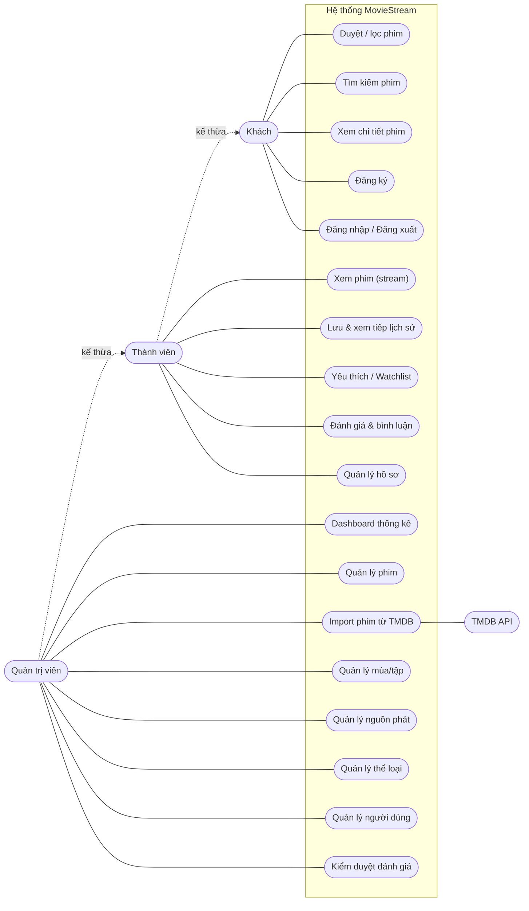

# Chương 2 — Phân tích yêu cầu & Use case

## 2.1. Tác nhân (Actors)

| Tác nhân | Mô tả |
|---|---|
| **Khách (Guest)** | Người dùng chưa đăng nhập. Duyệt và tra cứu thông tin phim. |
| **Thành viên (Member)** | Người dùng đã đăng nhập. Kế thừa quyền của Khách và có thêm các chức năng cá nhân hóa. |
| **Quản trị viên (Admin)** | Quản lý nội dung và vận hành hệ thống. Kế thừa quyền Thành viên. |
| **TMDB API** | Tác nhân hệ thống ngoài, cung cấp dữ liệu metadata phim khi Admin import. |

## 2.2. Yêu cầu chức năng (Functional Requirements)

### Nhóm Khách / chung
| Mã | Yêu cầu |
|---|---|
| FR-01 | Xem trang chủ với phim nổi bật (hero) và các hàng phim gợi ý (trending, mới nhất, theo thể loại). |
| FR-02 | Duyệt danh sách phim, lọc theo thể loại / năm / loại (phim lẻ – phim bộ) và sắp xếp. |
| FR-03 | Tìm kiếm phim theo từ khóa (gợi ý tức thời, có debounce). |
| FR-04 | Xem trang chi tiết phim: thông tin, poster/backdrop, thể loại, diễn viên, trailer, phim liên quan, đánh giá. |
| FR-05 | Đăng ký tài khoản bằng email + mật khẩu. |
| FR-06 | Đăng nhập / đăng xuất. |

### Nhóm Thành viên
| Mã | Yêu cầu |
|---|---|
| FR-07 | Xem (phát) phim/tập qua trình phát video. |
| FR-08 | Chọn nguồn phát / chất lượng (nếu phim có nhiều nguồn). |
| FR-09 | Đối với phim bộ: chọn mùa và tập để xem. |
| FR-10 | Tự động lưu **tiến độ xem** và cho phép **xem tiếp** từ vị trí dừng. |
| FR-11 | Xem **lịch sử xem** của bản thân. |
| FR-12 | Thêm/xóa phim vào **danh sách yêu thích**. |
| FR-13 | Thêm/xóa phim vào **danh sách xem sau (watchlist)**. |
| FR-14 | **Đánh giá** phim (điểm 1–10) kèm **bình luận**; sửa/xóa đánh giá của mình. |
| FR-15 | Quản lý **hồ sơ cá nhân** (tên hiển thị, ảnh đại diện, đổi mật khẩu). |

### Nhóm Quản trị viên
| Mã | Yêu cầu |
|---|---|
| FR-16 | Xem **dashboard** thống kê (số phim, người dùng, lượt xem, đánh giá). |
| FR-17 | **Quản lý phim**: thêm/sửa/xóa; đặt trạng thái (nháp/xuất bản) và phim nổi bật. |
| FR-18 | **Import phim từ TMDB**: tìm trên TMDB và nhập metadata vào hệ thống (1-click). |
| FR-19 | **Quản lý mùa/tập** cho phim bộ. |
| FR-20 | **Quản lý nguồn phát (link xem)** cho từng phim/tập (URL, loại MP4/HLS/embed, nhãn chất lượng, nguồn mặc định). |
| FR-21 | **Quản lý thể loại** (CRUD). |
| FR-22 | **Quản lý người dùng**: xem danh sách, đổi quyền, khóa/mở khóa tài khoản. |
| FR-23 | **Kiểm duyệt đánh giá/bình luận**: ẩn/xóa nội dung vi phạm. |

## 2.3. Yêu cầu phi chức năng (Non-Functional Requirements)

| Mã | Loại | Yêu cầu |
|---|---|---|
| NFR-01 | Hiệu năng | Trang chủ và danh sách tải nội dung chính < 2–3s ở mạng thông thường; dùng phân trang/tải theo nhu cầu cho danh sách lớn. |
| NFR-02 | Bảo mật | Mật khẩu băm bằng bcrypt; phân quyền theo vai trò; chống truy cập trái phép trang admin; chống XSS/CSRF/SQL Injection (ORM tham số hóa). |
| NFR-03 | Khả năng sử dụng | Giao diện trực quan, tiếng Việt, responsive trên điện thoại/máy tính bảng/desktop. |
| NFR-04 | Tương thích | Hoạt động trên các trình duyệt hiện đại (Chrome, Edge, Firefox, Safari). |
| NFR-05 | Khả năng bảo trì | Mã nguồn TypeScript, tổ chức module rõ ràng, có tài liệu; truy cập DB qua ORM. |
| NFR-06 | Khả năng mở rộng | Kiến trúc cho phép bổ sung tính năng (thanh toán, đề xuất, đa ngôn ngữ) mà không phá vỡ hệ thống. |
| NFR-07 | Độ tin cậy | Xử lý lỗi và thông báo rõ ràng; validate dữ liệu đầu vào ở cả client và server (Zod). |
| NFR-08 | SEO | Trang chi tiết phim có metadata (title, description, OpenGraph) để chia sẻ/SEO. |

## 2.4. Sơ đồ Use case tổng quát

> Ghi chú: Thành viên kế thừa toàn bộ use case của Khách; Quản trị viên kế thừa toàn bộ use case của Thành viên.

## 2.5. Đặc tả các Use case chính

### UC-02 — Đăng nhập
| Mục | Nội dung |
|---|---|
| **Tác nhân** | Khách |
| **Mục tiêu** | Xác thực để trở thành Thành viên/Admin |
| **Tiền điều kiện** | Đã có tài khoản |
| **Luồng chính** | 1. Người dùng mở trang Đăng nhập. 2. Nhập email + mật khẩu. 3. Hệ thống kiểm tra định dạng (Zod). 4. Hệ thống đối chiếu mật khẩu băm trong DB. 5. Tạo phiên đăng nhập (JWT/session) và chuyển về trang trước đó. |
| **Luồng phụ** | 3a. Dữ liệu sai định dạng → hiện lỗi tại form. 4a. Sai email/mật khẩu → báo "Email hoặc mật khẩu không đúng". 4b. Tài khoản bị khóa → báo tài khoản bị khóa. |
| **Hậu điều kiện** | Người dùng có phiên đăng nhập hợp lệ. |

### UC-06 — Xem phim (stream)
| Mục | Nội dung |
|---|---|
| **Tác nhân** | Thành viên |
| **Mục tiêu** | Phát nội dung phim/tập và theo dõi tiến độ |
| **Tiền điều kiện** | Đã đăng nhập; phim ở trạng thái xuất bản và có ít nhất 1 nguồn phát |
| **Luồng chính** | 1. Người dùng mở trang Xem của phim/tập. 2. Hệ thống tải nguồn phát mặc định và (nếu có) tiến độ xem trước đó. 3. Trình phát khởi tạo (HLS qua hls.js hoặc MP4 trực tiếp). 4. Người dùng xem; định kỳ hệ thống **lưu tiến độ** (vị trí giây). 5. Với phim bộ: hiển thị danh sách tập để chuyển tập. |
| **Luồng phụ** | 1a. Chưa đăng nhập → chuyển tới trang Đăng nhập rồi quay lại. 2a. Phim chưa có nguồn phát → hiển thị thông báo "Phim đang cập nhật". 3a. Nguồn lỗi → cho phép đổi nguồn khác. |
| **Hậu điều kiện** | Tiến độ xem được lưu; bản ghi lịch sử xem được tạo/cập nhật. |

### UC-09 — Đánh giá & bình luận
| Mục | Nội dung |
|---|---|
| **Tác nhân** | Thành viên |
| **Tiền điều kiện** | Đã đăng nhập |
| **Luồng chính** | 1. Tại trang chi tiết, người dùng chọn điểm (1–10) và nhập bình luận. 2. Hệ thống validate. 3. Lưu/cập nhật đánh giá (mỗi người 1 đánh giá/phim). 4. Cập nhật lại điểm trung bình hiển thị. |
| **Luồng phụ** | 3a. Đã có đánh giá → cập nhật thay vì tạo mới. 2a. Bình luận rỗng/quá dài → báo lỗi. |
| **Hậu điều kiện** | Đánh giá hiển thị công khai (trừ khi bị kiểm duyệt ẩn). |

### UC-13 — Import phim từ TMDB (Admin)
| Mục | Nội dung |
|---|---|
| **Tác nhân** | Quản trị viên, TMDB API |
| **Mục tiêu** | Nhập nhanh metadata phim từ TMDB vào hệ thống |
| **Tiền điều kiện** | Đăng nhập với quyền Admin; đã cấu hình `TMDB_API_KEY` |
| **Luồng chính** | 1. Admin mở chức năng Import, nhập từ khóa tìm kiếm. 2. Hệ thống gọi TMDB API, hiển thị kết quả (poster, tên, năm). 3. Admin chọn phim cần nhập. 4. Hệ thống lấy chi tiết phim từ TMDB (mô tả, thể loại, diễn viên, trailer...). 5. Hệ thống tạo bản ghi `Movie`, ánh xạ/khởi tạo `Genre`, lưu poster/backdrop path. 6. Báo nhập thành công; phim ở trạng thái **nháp**. |
| **Luồng phụ** | 2a. TMDB lỗi/timeout → báo lỗi, cho thử lại. 5a. Phim đã tồn tại (trùng `tmdbId`) → cập nhật metadata thay vì tạo mới. |
| **Hậu điều kiện** | Phim có trong DB; Admin bổ sung **nguồn phát** (UC-15) trước khi xuất bản. |

### UC-15 — Quản lý nguồn phát (Admin)
| Mục | Nội dung |
|---|---|
| **Tác nhân** | Quản trị viên |
| **Mục tiêu** | Gắn/chỉnh sửa link xem cho phim hoặc tập |
| **Luồng chính** | 1. Admin mở phim/tập cần quản lý. 2. Thêm nguồn: nhập URL, chọn loại (MP4/HLS/EMBED), nhãn chất lượng (vd "1080p"), đặt nguồn mặc định. 3. Hệ thống validate URL và lưu. 4. Có thể sửa/xóa/đổi nguồn mặc định. |
| **Luồng phụ** | 3a. URL không hợp lệ → báo lỗi. |
| **Hậu điều kiện** | Phim/tập có nguồn phát; sẵn sàng để xuất bản và xem. |

### UC-18 — Kiểm duyệt đánh giá (Admin)
| Mục | Nội dung |
|---|---|
| **Tác nhân** | Quản trị viên |
| **Luồng chính** | 1. Admin xem danh sách đánh giá/bình luận. 2. Lọc theo phim/người dùng/trạng thái. 3. Ẩn hoặc xóa nội dung vi phạm. |
| **Hậu điều kiện** | Nội dung vi phạm không còn hiển thị công khai. |

## 2.6. Bảng tổng hợp Use case ↔ Yêu cầu chức năng

| Use case | Yêu cầu liên quan |
|---|---|
| Duyệt / lọc phim | FR-01, FR-02 |
| Tìm kiếm phim | FR-03 |
| Xem chi tiết phim | FR-04 |
| Đăng ký / Đăng nhập | FR-05, FR-06 |
| Xem phim (stream) | FR-07, FR-08, FR-09 |
| Lưu & xem tiếp lịch sử | FR-10, FR-11 |
| Yêu thích / Watchlist | FR-12, FR-13 |
| Đánh giá & bình luận | FR-14 |
| Quản lý hồ sơ | FR-15 |
| Dashboard | FR-16 |
| Quản lý phim / mùa-tập | FR-17, FR-19 |
| Import TMDB | FR-18 |
| Quản lý nguồn phát | FR-20 |
| Quản lý thể loại | FR-21 |
| Quản lý người dùng | FR-22 |
| Kiểm duyệt đánh giá | FR-23 |
