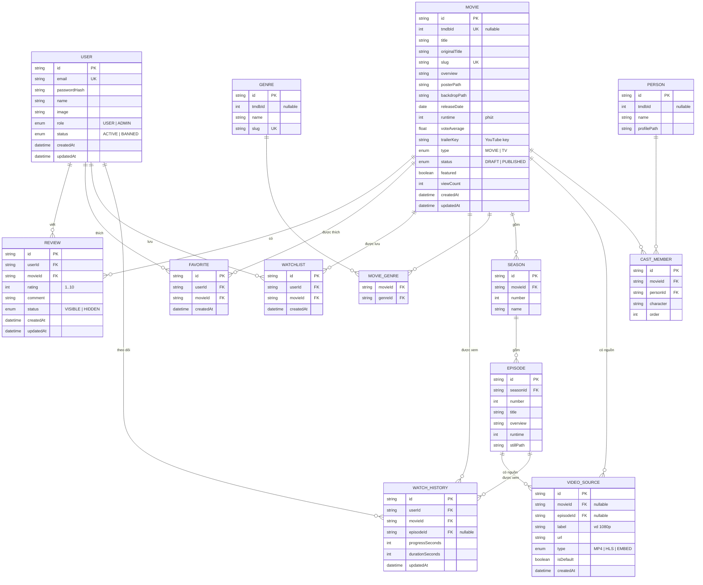

# Chương 3 — Thiết kế cơ sở dữ liệu

Hệ quản trị CSDL: **PostgreSQL**. Truy cập qua **Prisma ORM**. Khóa chính dùng chuỗi `cuid`/`uuid` (ký hiệu `id`). Các dấu thời gian `createdAt`/`updatedAt` mặc định do ứng dụng quản lý.

## 3.1. Sơ đồ thực thể – quan hệ (ERD)

## 3.2. Các quan hệ chính

- **User – Movie** thông qua các bảng trung gian: `Review`, `Favorite`, `Watchlist`, `WatchHistory` (mỗi quan hệ mang ngữ nghĩa riêng).
- **Movie – Genre**: nhiều–nhiều qua `MovieGenre`.
- **Movie – Season – Episode**: phân cấp cho phim bộ. Phim lẻ (`type = MOVIE`) không cần Season/Episode.
- **VideoSource** gắn với **Movie** (phim lẻ) *hoặc* **Episode** (phim bộ) — đúng một trong hai khác null.
- **WatchHistory** ghi tiến độ theo `movieId` và (nếu phim bộ) `episodeId`.
- **Movie – Person**: nhiều–nhiều qua `CastMember` (diễn viên & vai diễn).

## 3.3. Từ điển dữ liệu (Data Dictionary)

### Bảng `User` — Người dùng
| Cột | Kiểu | Ràng buộc | Mô tả |
|---|---|---|---|
| id | String | PK | Định danh người dùng |
| email | String | UNIQUE, NOT NULL | Email đăng nhập |
| passwordHash | String | NOT NULL | Mật khẩu đã băm (bcrypt) |
| name | String | NULL | Tên hiển thị |
| image | String | NULL | URL ảnh đại diện |
| role | Enum(USER, ADMIN) | DEFAULT USER | Vai trò/phân quyền |
| status | Enum(ACTIVE, BANNED) | DEFAULT ACTIVE | Trạng thái tài khoản |
| createdAt | DateTime | DEFAULT now() | Ngày tạo |
| updatedAt | DateTime | auto | Cập nhật gần nhất |

### Bảng `Movie` — Phim
| Cột | Kiểu | Ràng buộc | Mô tả |
|---|---|---|---|
| id | String | PK | Định danh phim |
| tmdbId | Int | UNIQUE, NULL | ID gốc trên TMDB (nếu import) |
| title | String | NOT NULL | Tên phim (tiếng Việt/hiển thị) |
| originalTitle | String | NULL | Tên gốc |
| slug | String | UNIQUE | Đường dẫn thân thiện |
| overview | Text | NULL | Mô tả nội dung |
| posterPath | String | NULL | Đường dẫn ảnh poster |
| backdropPath | String | NULL | Đường dẫn ảnh nền |
| releaseDate | Date | NULL | Ngày phát hành |
| runtime | Int | NULL | Thời lượng (phút) |
| voteAverage | Float | DEFAULT 0 | Điểm đánh giá tham chiếu (TMDB) |
| trailerKey | String | NULL | Mã trailer YouTube |
| type | Enum(MOVIE, TV) | DEFAULT MOVIE | Phim lẻ hay phim bộ |
| status | Enum(DRAFT, PUBLISHED) | DEFAULT DRAFT | Trạng thái xuất bản |
| featured | Boolean | DEFAULT false | Phim nổi bật (hero) |
| viewCount | Int | DEFAULT 0 | Lượt xem |
| createdAt / updatedAt | DateTime | | Dấu thời gian |

### Bảng `Genre` — Thể loại
| Cột | Kiểu | Ràng buộc | Mô tả |
|---|---|---|---|
| id | String | PK | Định danh thể loại |
| tmdbId | Int | NULL | ID thể loại trên TMDB |
| name | String | NOT NULL | Tên thể loại |
| slug | String | UNIQUE | Đường dẫn thân thiện |

### Bảng `MovieGenre` — Liên kết Phim–Thể loại
| Cột | Kiểu | Ràng buộc | Mô tả |
|---|---|---|---|
| movieId | String | FK → Movie, PK kép | |
| genreId | String | FK → Genre, PK kép | |

### Bảng `Season` — Mùa phim
| Cột | Kiểu | Ràng buộc | Mô tả |
|---|---|---|---|
| id | String | PK | |
| movieId | String | FK → Movie | Phim bộ chứa mùa |
| number | Int | NOT NULL | Số thứ tự mùa |
| name | String | NULL | Tên mùa |

### Bảng `Episode` — Tập phim
| Cột | Kiểu | Ràng buộc | Mô tả |
|---|---|---|---|
| id | String | PK | |
| seasonId | String | FK → Season | Mùa chứa tập |
| number | Int | NOT NULL | Số thứ tự tập |
| title | String | NULL | Tên tập |
| overview | Text | NULL | Mô tả tập |
| runtime | Int | NULL | Thời lượng (phút) |
| stillPath | String | NULL | Ảnh đại diện tập |

### Bảng `VideoSource` — Nguồn phát (link xem)
| Cột | Kiểu | Ràng buộc | Mô tả |
|---|---|---|---|
| id | String | PK | |
| movieId | String | FK → Movie, NULL | Gắn với phim lẻ |
| episodeId | String | FK → Episode, NULL | Gắn với tập (phim bộ) |
| label | String | NULL | Nhãn chất lượng (vd "1080p") |
| url | String | NOT NULL | Đường dẫn video |
| type | Enum(MP4, HLS, EMBED) | DEFAULT MP4 | Loại nguồn |
| isDefault | Boolean | DEFAULT false | Nguồn phát mặc định |
| createdAt | DateTime | | |

> Ràng buộc nghiệp vụ: `movieId` và `episodeId` không đồng thời null và không đồng thời có giá trị (CHECK / kiểm tra ở tầng ứng dụng).

### Bảng `Person` — Diễn viên/Nhân sự
| Cột | Kiểu | Ràng buộc | Mô tả |
|---|---|---|---|
| id | String | PK | |
| tmdbId | Int | NULL | ID trên TMDB |
| name | String | NOT NULL | Tên |
| profilePath | String | NULL | Ảnh chân dung |

### Bảng `CastMember` — Vai diễn (Phim–Người)
| Cột | Kiểu | Ràng buộc | Mô tả |
|---|---|---|---|
| id | String | PK | |
| movieId | String | FK → Movie | |
| personId | String | FK → Person | |
| character | String | NULL | Tên nhân vật |
| order | Int | DEFAULT 0 | Thứ tự hiển thị |

### Bảng `Review` — Đánh giá & bình luận
| Cột | Kiểu | Ràng buộc | Mô tả |
|---|---|---|---|
| id | String | PK | |
| userId | String | FK → User | Người đánh giá |
| movieId | String | FK → Movie | Phim được đánh giá |
| rating | Int | 1..10 | Điểm |
| comment | Text | NULL | Nội dung bình luận |
| status | Enum(VISIBLE, HIDDEN) | DEFAULT VISIBLE | Trạng thái kiểm duyệt |
| createdAt / updatedAt | DateTime | | |

> Ràng buộc: UNIQUE(`userId`, `movieId`) — mỗi người 1 đánh giá/phim.

### Bảng `Favorite` — Yêu thích
| Cột | Kiểu | Ràng buộc | Mô tả |
|---|---|---|---|
| id | String | PK | |
| userId | String | FK → User | |
| movieId | String | FK → Movie | |
| createdAt | DateTime | | |

> Ràng buộc: UNIQUE(`userId`, `movieId`).

### Bảng `Watchlist` — Danh sách xem sau
| Cột | Kiểu | Ràng buộc | Mô tả |
|---|---|---|---|
| id | String | PK | |
| userId | String | FK → User | |
| movieId | String | FK → Movie | |
| createdAt | DateTime | | |

> Ràng buộc: UNIQUE(`userId`, `movieId`).

### Bảng `WatchHistory` — Lịch sử & tiến độ xem
| Cột | Kiểu | Ràng buộc | Mô tả |
|---|---|---|---|
| id | String | PK | |
| userId | String | FK → User | |
| movieId | String | FK → Movie | |
| episodeId | String | FK → Episode, NULL | Tập đang xem (phim bộ) |
| progressSeconds | Int | DEFAULT 0 | Vị trí đang xem (giây) |
| durationSeconds | Int | DEFAULT 0 | Tổng thời lượng (giây) |
| updatedAt | DateTime | | Lần xem gần nhất |

> Ràng buộc: UNIQUE(`userId`, `movieId`, `episodeId`).

## 3.4. Ghi chú thiết kế

- **Chỉ lưu đường dẫn (path) ảnh/video**, không lưu file nhị phân trong DB. Ảnh dựng URL đầy đủ từ TMDB (`https://image.tmdb.org/t/p/...`).
- **Xóa mềm vs xóa cứng**: Review dùng trạng thái `HIDDEN` (xóa mềm cho kiểm duyệt); người dùng bị khóa dùng `status = BANNED`.
- **Bảng xác thực Auth.js** (`Account`, `Session`, `VerificationToken`) chỉ cần khi dùng OAuth/DB session. Với phương án Credentials + JWT, các bảng này có thể bỏ; nếu mở rộng đăng nhập Google sẽ bổ sung theo chuẩn `@auth/prisma-adapter`.
- **Chỉ mục (index)**: tạo index cho `Movie.slug`, `Movie.status`, `Movie.type`, các khóa ngoại và các cột UNIQUE để tối ưu truy vấn danh sách/lọc.
