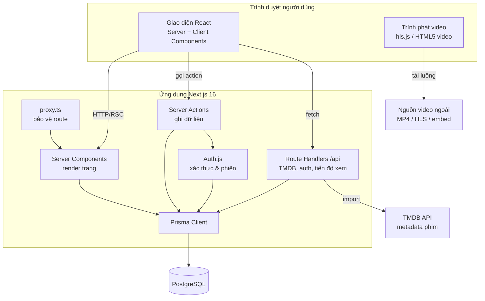
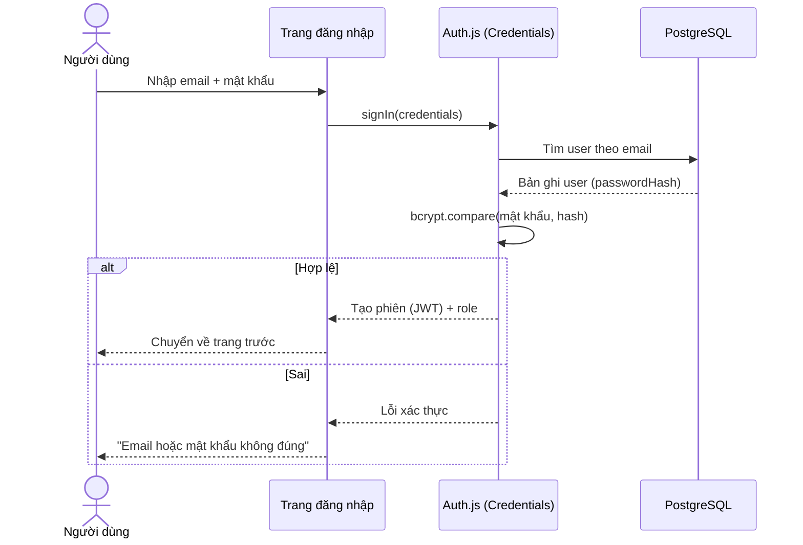
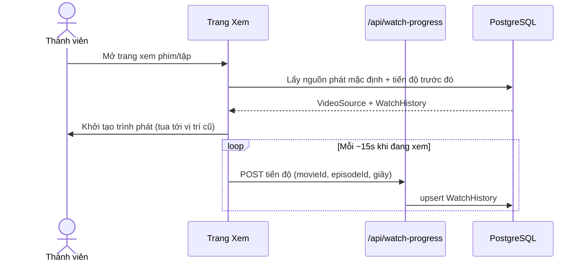
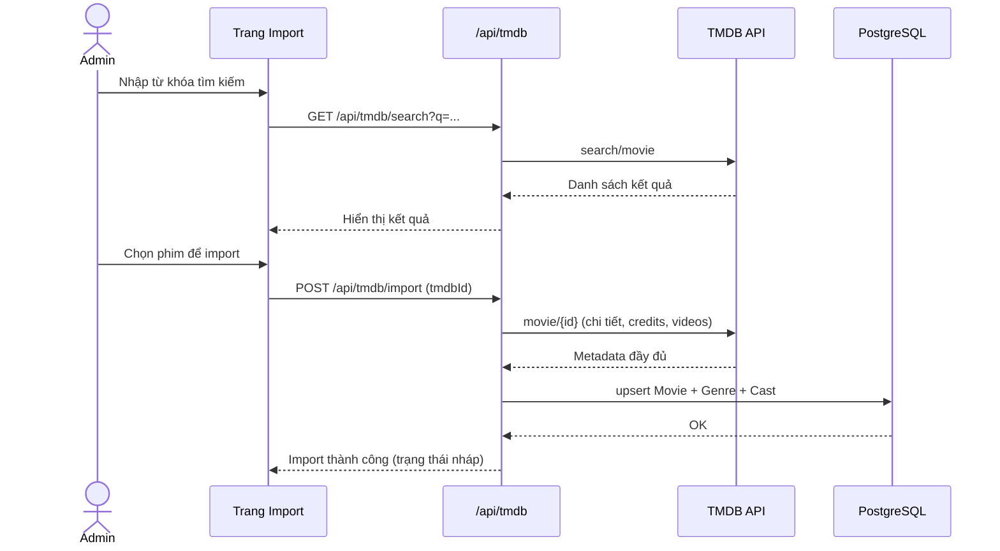
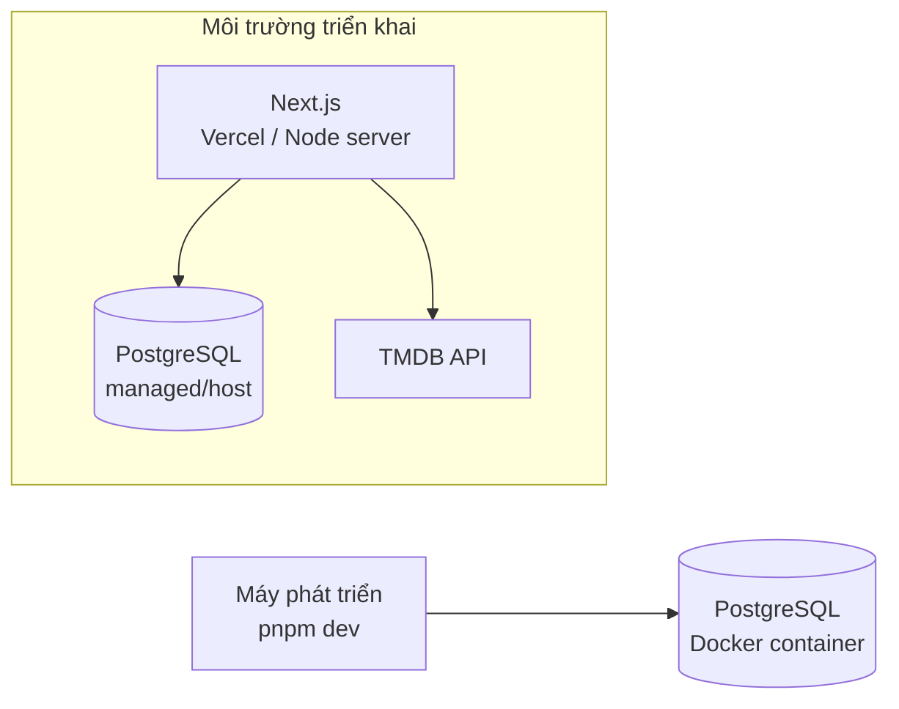

# Chương 4 — Kiến trúc & Công nghệ

## 4.1. Tổng quan kiến trúc

Hệ thống xây dựng theo mô hình **full-stack hợp nhất trên Next.js 16 (App Router)**: phần giao diện (React Server/Client Components) và phần xử lý phía máy chủ (Server Actions, Route Handlers) nằm chung trong một ứng dụng, truy cập cơ sở dữ liệu PostgreSQL qua Prisma ORM. Dữ liệu metadata phim được nạp từ **TMDB API**; video được phát từ **nguồn ngoài** (đường dẫn do Admin nhập).

## 4.2. Phân lớp (Layered architecture)

| Lớp | Thành phần | Trách nhiệm |
|---|---|---|
| **Trình bày (Presentation)** | React Server/Client Components, Tailwind CSS, shadcn/ui | Hiển thị giao diện, tương tác người dùng, trình phát video |
| **Ứng dụng/Nghiệp vụ (Application)** | Server Actions, Route Handlers, service trong `src/server` | Xử lý logic: xác thực, import TMDB, lưu tiến độ, kiểm duyệt, CRUD |
| **Truy cập dữ liệu (Data Access)** | Prisma Client (`src/lib/prisma.ts`) | Ánh xạ đối tượng ↔ bảng, truy vấn an toàn (tham số hóa) |
| **Dữ liệu (Database)** | PostgreSQL | Lưu trữ bền vững |
| **Tích hợp ngoài (Integration)** | TMDB API client (`src/lib/tmdb.ts`) | Lấy metadata phim |

## 4.3. Luồng xử lý chính

### 4.3.1. Đăng nhập & phân quyền

### 4.3.2. Xem phim & lưu tiến độ

### 4.3.3. Import phim từ TMDB (Admin)

## 4.4. Công nghệ sử dụng & lý do chọn

| Thành phần | Công nghệ | Lý do chọn |
|---|---|---|
| Framework | **Next.js 16 (App Router)** | Full-stack trong một codebase (giảm hạ tầng); Server Components giúp tải nhanh, SEO tốt; Server Actions đơn giản hóa xử lý form. |
| Ngôn ngữ | **TypeScript** | Kiểu tĩnh, ít lỗi, dễ bảo trì — phù hợp dự án nhiều module. |
| Giao diện | **Tailwind CSS + shadcn/ui** | Dựng UI nhanh, nhất quán, dễ tùy biến theo phong cách dark/Netflix. |
| ORM | **Prisma** | Mô hình hóa dữ liệu rõ ràng, type-safe, migration tiện lợi, chống SQL Injection. |
| CSDL | **PostgreSQL** | Quan hệ mạnh, ổn định, phù hợp dữ liệu nhiều bảng và truy vấn lọc. |
| Xác thực | **Auth.js (NextAuth v5)** | Chuẩn cho Next.js, hỗ trợ Credentials + JWT, dễ mở rộng OAuth (Google). |
| Mật khẩu | **bcryptjs** | Băm mật khẩu an toàn, thuần JS (chạy tốt trên Windows). |
| Validate | **Zod** (+ react-hook-form) | Kiểm tra dữ liệu nhất quán client/server. |
| Video | **hls.js** + HTML5 video | Phát luồng HLS (.m3u8) trên trình duyệt và MP4 trực tiếp. |
| Dữ liệu phim | **TMDB API** | Kho metadata phim phong phú, miễn phí cho mục đích học tập. |
| Môi trường dev | **Docker (PostgreSQL)** | Dựng DB nhanh, không cần cài đặt thủ công. |
| Quản lý gói | **pnpm** | Cài đặt nhanh, tiết kiệm dung lượng. |

## 4.5. Bảo mật

- **Băm mật khẩu** bằng bcrypt (không lưu mật khẩu thô).
- **Phân quyền theo vai trò**: kiểm tra `role = ADMIN` ở `proxy.ts` (chặn sơ bộ) **và** kiểm tra lại trong Server Actions/Route Handlers (chặn thực sự ở tầng nghiệp vụ).
- **Chống SQL Injection**: mọi truy vấn qua Prisma (tham số hóa).
- **Validate đầu vào** bằng Zod ở cả client và server.
- **Bảo vệ phiên**: JWT ký bằng `AUTH_SECRET`, cookie HTTP-only.
- **Biến môi trường nhạy cảm** (`TMDB_API_KEY`, `DATABASE_URL`, `AUTH_SECRET`) đặt trong `.env`, không commit.

## 4.6. Mô hình triển khai (Deployment)

- **Phát triển**: chạy `pnpm dev`, PostgreSQL qua Docker Compose.
- **Triển khai thật (hướng phát triển)**: deploy Next.js lên Vercel hoặc máy chủ Node; PostgreSQL dùng dịch vụ quản lý (Neon/Supabase/RDS). Biến môi trường cấu hình trên nền tảng triển khai.
