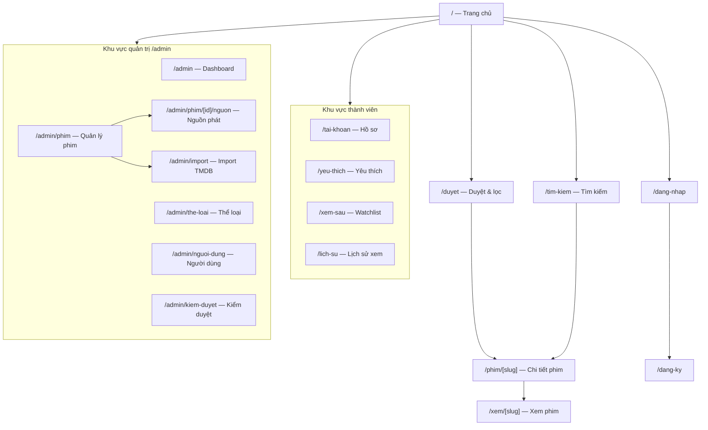
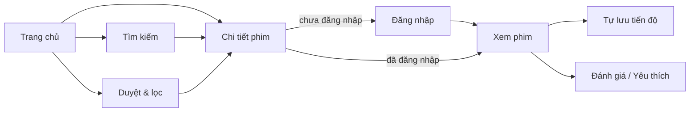

# Chương 5 — Thiết kế giao diện

Phong cách: **giao diện tối (dark mode)** kiểu nền tảng xem phim hiện đại (Netflix), tập trung vào hình ảnh poster, các hàng phim cuộn ngang, hero banner lớn. Giao diện **responsive** và **tiếng Việt**.

## 5.1. Sơ đồ phân cấp trang (Sitemap)



## 5.2. Hệ thống thiết kế (Design system)

| Yếu tố | Quy định |
|---|---|
| Bảng màu nền | Đen/xám đậm (`#0a0a0a`, `#141414`, `#1f1f1f`) |
| Màu nhấn (accent) | Đỏ/cam điện ảnh (vd `#e50914` hoặc tùy chỉnh) cho nút chính, điểm nhấn |
| Chữ | Sans-serif (Inter/Geist); tiêu đề đậm, nội dung dễ đọc, tương phản cao trên nền tối |
| Bo góc | Vừa phải (poster card bo nhẹ), bóng đổ tinh tế khi hover |
| Tương tác | Poster phóng to nhẹ + hiện thông tin khi hover; chuyển trang mượt |
| Thành phần dùng lại | `MovieCard`, `MovieRow` (cuộn ngang), `Hero`, `VideoPlayer`, `Navbar`, `Footer`, `RatingStars`, `Badge`, `Skeleton` |
| Responsive | Mobile-first: số cột poster co theo màn hình; menu thu gọn trên mobile |

## 5.3. Mô tả wireframe các màn hình chính

### 5.3.1. Trang chủ (`/`)
```
┌───────────────────────────────────────────────────────────┐
│ NAVBAR  Logo   Trang chủ  Duyệt  [ô tìm kiếm]   [Đăng nhập]│
├───────────────────────────────────────────────────────────┤
│ ███████████  HERO (backdrop phim nổi bật)  ███████████      │
│   Tên phim (lớn) · điểm · năm · thể loại                    │
│   [ ▶ Xem ngay ]   [ + Danh sách ]   mô tả ngắn...          │
├───────────────────────────────────────────────────────────┤
│ Đang thịnh hành                                    ‹  ›     │
│ [poster][poster][poster][poster][poster][poster] →         │
│ Mới cập nhật                                       ‹  ›     │
│ [poster][poster][poster][poster][poster][poster] →         │
│ Hành động · Tình cảm · Kinh dị ... (mỗi thể loại 1 hàng)    │
├───────────────────────────────────────────────────────────┤
│ FOOTER                                                      │
└───────────────────────────────────────────────────────────┘
```
- Hero tự đổi/hoặc chọn phim `featured`. Mỗi hàng là `MovieRow` cuộn ngang gồm nhiều `MovieCard`.

### 5.3.2. Duyệt & lọc (`/duyet`)
```
┌───────────────────────────────────────────────────────────┐
│ NAVBAR                                                      │
├──────────────┬────────────────────────────────────────────┤
│ BỘ LỌC       │ Lưới poster (grid)                          │
│ Thể loại ▾   │ [card][card][card][card][card]              │
│ Năm ▾        │ [card][card][card][card][card]              │
│ Loại ▾       │ [card][card][card][card][card]              │
│ Sắp xếp ▾    │ ... (phân trang / tải thêm)                 │
└──────────────┴────────────────────────────────────────────┘
```

### 5.3.3. Chi tiết phim (`/phim/[slug]`)
```
┌───────────────────────────────────────────────────────────┐
│ ░░ Backdrop mờ phía sau ░░                                  │
│ ┌────────┐  Tên phim (H1)   ★ 8.5/10                        │
│ │ POSTER │  Năm · Thời lượng · Thể loại [badge][badge]      │
│ │        │  [ ▶ Xem phim ] [ ♥ Yêu thích ] [ + Xem sau ]    │
│ └────────┘  Mô tả nội dung...                               │
├───────────────────────────────────────────────────────────┤
│ Diễn viên: [ảnh][ảnh][ảnh]...   |  Trailer ▶                │
├───────────────────────────────────────────────────────────┤
│ (Phim bộ) Danh sách tập: [T1][T2][T3]...                    │
├───────────────────────────────────────────────────────────┤
│ Đánh giá & bình luận                                        │
│  ★★★★★ [ô nhập đánh giá + bình luận]  [Gửi]                 │
│  - User A (9/10): "..."                                     │
│  - User B (7/10): "..."                                     │
├───────────────────────────────────────────────────────────┤
│ Phim liên quan: [card][card][card][card]                   │
└───────────────────────────────────────────────────────────┘
```

### 5.3.4. Trang xem phim (`/xem/[slug]`)
```
┌───────────────────────────────────────────────────────────┐
│ ◀ Quay lại     Tên phim — Tập x (nếu phim bộ)              │
├───────────────────────────────────────────────────────────┤
│ ┌───────────────────────────────────────────────────────┐ │
│ │                                                       │ │
│ │            ▶  TRÌNH PHÁT VIDEO (16:9)                  │ │
│ │   [⏯] ──────●────────  [🔊] [chất lượng ▾] [⛶]        │ │
│ └───────────────────────────────────────────────────────┘ │
│ Nguồn: [1080p ▾]   (đổi nguồn nếu lỗi)                      │
├───────────────────────────────────────────────────────────┤
│ (Phim bộ) Tập: [1][2][3][4][5]... (tập đang xem nổi bật)   │
├───────────────────────────────────────────────────────────┤
│ Thông tin phim ngắn · nút Yêu thích                        │
└───────────────────────────────────────────────────────────┘
```
- Trình phát tự **tua tới tiến độ cũ** và **lưu tiến độ** định kỳ. Hỗ trợ toàn màn hình, đổi nguồn/chất lượng.

### 5.3.5. Đăng nhập / Đăng ký (`/dang-nhap`, `/dang-ky`)
```
┌───────────────────────────┐
│        MovieStream        │
│  ┌─────────────────────┐  │
│  │ Email               │  │
│  │ Mật khẩu            │  │
│  │ [ Đăng nhập ]       │  │
│  │ Chưa có tài khoản?  │  │
│  └─────────────────────┘  │
└───────────────────────────┘
```

### 5.3.6. Trang quản trị (`/admin`)
```
┌───────────────┬───────────────────────────────────────────┐
│ SIDEBAR       │ DASHBOARD                                   │
│ • Dashboard   │ [Số phim] [Người dùng] [Lượt xem] [Đánh giá]│
│ • Phim        │ Biểu đồ / danh sách phim mới nhất           │
│ • Import TMDB ├───────────────────────────────────────────┤
│ • Thể loại    │ (Trang Phim) Bảng: Tên | Loại | TT | Thao tác│
│ • Người dùng  │ [Thêm] [Sửa] [Xóa] [Quản lý nguồn phát]     │
│ • Kiểm duyệt  │                                             │
└───────────────┴───────────────────────────────────────────┘
```
- Bố cục sidebar + vùng nội dung. Bảng dữ liệu có tìm kiếm, phân trang, thao tác CRUD. Trang **Import TMDB** có ô tìm kiếm + lưới kết quả + nút "Import". Trang **Nguồn phát** cho thêm/sửa/xóa link theo phim/tập.

## 5.4. Luồng điều hướng người dùng tiêu biểu



## 5.5. Ghi chú về trải nghiệm

- **Skeleton/loading** khi tải danh sách và trang chi tiết (dùng Suspense của Next.js 16).
- **Trạng thái rỗng** rõ ràng (chưa có phim yêu thích, chưa có lịch sử...).
- **Thông báo lỗi/thành công** (toast) cho các thao tác (đăng nhập sai, thêm yêu thích, gửi đánh giá...).
- **Khả năng truy cập (a11y)**: tương phản đủ, focus rõ ràng, phím tắt cơ bản cho trình phát.
